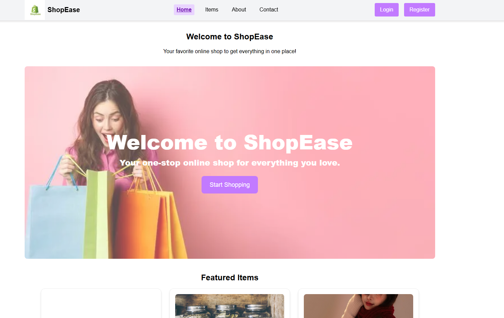

# 🛍️ ShopEase - Modern E-commerce Platform

ShopEase is a high-performance e-commerce web application built with **Next.js 14**, **Tailwind CSS**, and the **MERN** stack. It features a seamless shopping experience with server-side rendering, role-based access, and secure authentication.

## 🚀 Live Links
- **Live Website:** https://shop-ease-server-pink.vercel.app/
- **Server Repository:** https://github.com/mehers-bonna/shop-ease-server.git

---

## 📸 Project Preview
<p align="center">
  
</p>

---

## 📖 Project Overview
ShopEase provides a modern shopping interface where users can explore a wide range of products. The application focuses on speed and user experience, utilizing **Next.js** for optimal performance. Authenticated users (Admins) gain access to specialized inventory management tools directly from the UI.

### 👤 Key Functionalities
- **Public Users:** Can browse the Home page, view all items in a grid layout, and see detailed product information.
- **Authenticated Users (Admin):** Can add new products, update existing product details, and delete items through a private management dashboard.
- **Authentication:** Secure login and registration powered by **NextAuth.js**.

---

## ✨ Features
- **Server-Side Rendering (SSR):** Optimized SEO and fast page loads using Next.js.
- **Responsive Design:** Fully mobile and desktop-friendly UI built with Tailwind CSS.
- **Authentication:** Secure user sessions with NextAuth.js.
- **Inventory Management:** CRUD operations (Create, Read, Update, Delete) for products.
- **Protected Routes:** Only logged-in users can access `Add Item` and `Manage Items`.
- **User-Friendly Navigation:** Profile-hover dropdown menu for quick access to admin tools.

---

## 🛠️ Technologies Used

### **Frontend:**


### **Backend & Database:**


---

## 📍 Route Summary
- `/` - **Home Page:** Featured products and main banner.
- `/items` - **All Items:** Browse all products in a responsive grid.
- `/items/[id]` - **Details:** Complete information for a specific product.
- `/login` / `/register` - **Auth:** User authentication via NextAuth.
- `/add-item` - **Admin:** Form to add new products (Protected).
- `/manage-items` - **Admin:** Dashboard to Update/Delete products (Protected).
- `/about` / `/contact` - **Company:** General info and contact form.

---

## 💻 Installation & Local Setup

1. **Clone the repository:**
   ```bash
   git clone https://github.com/mehers-bonna/shop-ease-server.git
   cd shop-ease

2. npm install

3. Set up Environment Variables: Create a .env.local file and add your credentials:

MONGODB_URI=your_mongodb_uri
NEXTAUTH_SECRET=your_secret
NEXT_PUBLIC_API_URL=your_backend_url

4.npm run dev
